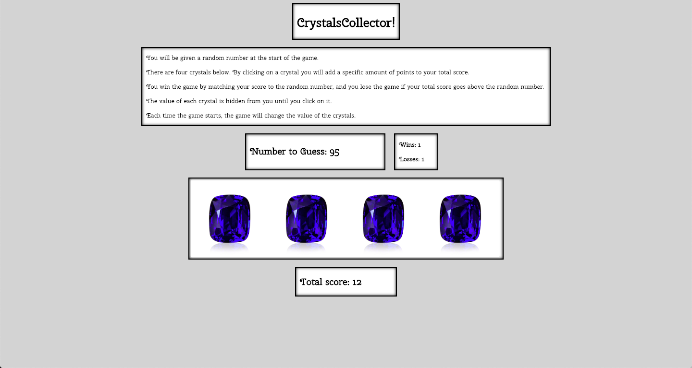

This app is a game that tests your memory and arithmetic skills. The user is given a random number at the start. There are four images of crystals. By clicking on an image, the user will add a specific amount of points to her or his total score. You win the game by matching your score to the random number, and you lose the game if your total score goes above the random number. The value of each crystal is hidden from you until you click on it. Each time the game starts, the value each crystal changes. You can use the deployed app here: https://tomstone76.github.io/unit-4-game/

Technologies used: JavaScript, JQuery, HTML, and CSS

